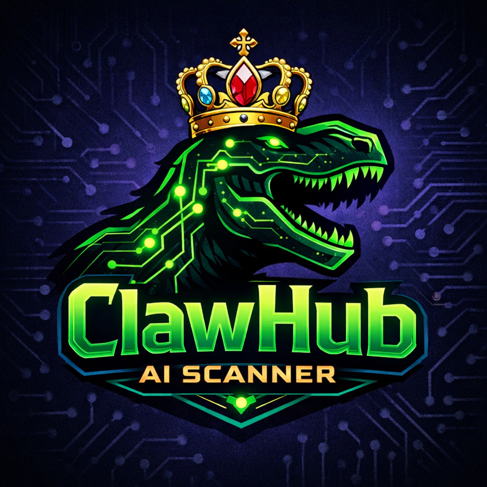

<div align="center">



</div>

# Shield + Dino 🦖🛡️

Shield + Dino - Security scanner for OpenClaw skills. Built for the Dino Dynasty ecosystem.

A comprehensive security auditing tool for OpenClaw skills and general Python/code analysis. Detects prompt injection, dangerous operations, data exfiltration, obfuscation, and other security risks with intelligent false-positive filtering.


---

## 📋 Table of Contents

- [Overview](#overview)
- [Features](#features)
- [What It Detects](#what-it-detects)
- [Installation](#installation)
- [Usage](#usage)
- [Output Explained](#output-explained)
- [Risk Scoring](#risk-scoring)
- [False Positive Filtering](#false-positive-filtering)
- [Integration Examples](#integration-examples)
- [Contributing](#contributing)
- [License](#license)

---

## Overview

OpenClaw skills can contain malicious code that poses security risks. This scanner audits skill files for:

- **Prompt injection attacks** designed to override AI instructions
- **Dangerous system operations** (rm -rf, format, shutdown)
- **Data exfiltration** attempts (sending data to external servers)
- **Code execution vulnerabilities** (eval, exec, pickle)
- **Obfuscation techniques** (base64, hex encoding)
- **Shell injection** (dynamic command execution)

The scanner is designed with **intelligent false-positive filters** to ignore legitimate code patterns like API calls, subprocess usage, and documentation references.

---

## Features

✅ **Multi-Pattern Detection** - Scans for 6 major vulnerability categories  
✅ **Smart Filtering** - 15+ false positive patterns to reduce noise  
✅ **Severity Scoring** - CRITICAL / HIGH / MEDIUM / INFO levels  
✅ **Risk Score Calculation** - 0-10 weighted risk score  
✅ **Directory Scanning** - Batch scan entire skill repositories  
✅ **Line-by-Line Reporting** - Exact location of findings  
✅ **No Dependencies** - Pure Python stdlib, no pip install required  
✅ **Safe-by-Default** - Read-only analysis, never modifies files  

---

## What It Detects

### 1. Prompt Injection (CRITICAL)
Attempts to override or manipulate AI behavior:
```
ignore previous instructions
forget all instructions
you are now acting as
developer mode
jailbreak
```

### 2. Dangerous Operations (CRITICAL)
Harmful system commands:
```
rm -rf /          # Delete everything
format C:         # Format disk
shutdown now      # Shutdown system
chmod 777         # World-writable permissions
```

### 3. Code Execution (HIGH)
Arbitrary code execution vulnerabilities:
```
eval()
exec()
compile()
__import__()
pickle.load()
marshal.load()
yaml.load()
```

### 4. Data Exfiltration (HIGH)
Unauthorized data sending:
```
requests.post() to unknown domains
socket.connect()
socket.send()
curl/wget to external servers
```

### 5. Shell Injection (MEDIUM)
Dynamic command execution:
```
os.system()
os.popen()
Shell metacharacters (&&, ||) with dynamic input
```

### 6. Obfuscation (MEDIUM)
Hidden/masked code:
```
Long base64 strings (100+ chars)
Hex-encoded payloads (\x41\x42)
Unicode escapes (\u0041)
Dynamic imports
```

### 7. External Domains (INFO)
External non-API URLs (informational):
```
http://example.com/path
https://suspicious-site.net/
```

---

## Installation

### Option 1: Clone the Repository

```bash
git clone https://github.com/yourusername/skill-scanner.git
cd skill-scanner
```

### Option 2: Direct Download

```bash
wget https://raw.githubusercontent.com/yourusername/skill-scanner/main/skill_scanner.py
chmod +x skill_scanner.py
```

### Requirements

- **Python 3.7+** (no external dependencies)
- Works on Linux, macOS, and Windows

---

## 🐳 Docker Mode (Air-Gap Safe!)

For maximum security, run in Docker with **zero network access**:

### Quick Start

```bash
# Clone repo, scan, generate report, nuke all
docker-compose -f docker-compose.scan.yml build
docker-compose -f docker-compose.scan.yml up

# View report
cat scan_results/audit_report.md

# NUKE - Delete everything!
docker-compose -f docker-compose.scan.yml down -v
```

### Scan Custom Repos

```bash
# Scan any GitHub repo
docker-compose -f docker-compose.scan.yml build --build-arg REPO_URL=https://github.com/user/repo.git
docker-compose -f docker-compose.scan.yml up
```

### Air-Gap Mode (No Network)

Edit `docker-compose.scan.yml` and uncomment:
```yaml
network_mode: none  # NO NETWORK - maximum security!
```

---

## Usage

### Scan a Single File

```bash
python skill_scanner.py --file path/to/suspicious_skill.py
```

### Scan a Directory (Batch Mode)

```bash
python skill_scanner.py --dir /path/to/skills/
```

### Scan with Custom File Extension Filter

The scanner automatically detects `.py`, `.md`, `.txt`, `.json`, `.js`, and `.sh` files. For other extensions, copy the file content to a supported format first.

### Example Output

```
============================================================
SHIELD + DINO SECURITY SCANNER v1
Refined with false positive filtering
============================================================

============================================================
SCANNING: suspicious_skill.py
============================================================

Risk Score: 7.5/10
Recommendation: [HIGH RISK]
2 high-risk issues - careful review needed

FINDINGS (3):

[!] CRITICAL (1):
  Line 45: ignore previous instructions
  Line 67: you are now acting as

[+] HIGH (2):
  Line 23: eval(
  Line 89: pickle.load(
```

---

## Output Explained

### Risk Score (0-10)

| Score | Level | Action |
|-------|-------|--------|
| 0 | SAFE | No issues detected |
| 1-3 | LOW RISK | Minor issues, likely safe |
| 4-6 | MODERATE | Some issues to review |
| 7-9 | HIGH RISK | High-risk issues found |
| 10 | DANGER | Critical issues detected |

### Severity Levels

- **CRITICAL**: Immediate threat, block deployment
- **HIGH**: Significant risk, requires review
- **MEDIUM**: Potential issue, investigate
- **INFO**: Informational, typically benign

### Recommendation

- **[SAFE]**: Approved for use
- **[LOW RISK]**: Minor issues, likely safe
- **[MODERATE]**: Some issues to review before use
- **[HIGH RISK]**: High-risk issues found
- **[DANGER]**: Critical issues - do not use

---

## 🎨 Rich CLI Dashboard

For a beautiful terminal dashboard, install `rich` and use the `--dashboard` flag:

```bash
# Install rich
pip install rich

# Run with dashboard
python skill_scanner.py --dir /path/to/skills/ --dashboard
```

This shows:
- 🦖 ASCII art header
- 📊 Color-coded results table
- 📈 Summary with risk score
- 🔴🟠🟡🟢 Severity indicators

---

## Credits

## Risk Scoring Algorithm

The risk score is calculated as a weighted average:

```python
severity_scores = {
    'CRITICAL': 10,
    'HIGH': 7,
    'MEDIUM': 4,
    'INFO': 2
}

weighted_score = sum(severity_scores[finding.severity]) / num_findings
final_score = min(10, weighted_score * 1.5)
```

This means a single CRITICAL finding will significantly impact the score.

---

## False Positive Filtering

The scanner includes intelligent filters to ignore common safe patterns:

### Safe Patterns Ignored

| Pattern | Why It's Safe |
|---------|--------------|
| `api.openai.com` | Legitimate OpenAI API |
| `api.anthropic.com` | Legitimate Anthropic API |
| `api.google.com` | Legitimate Google API |
| `subprocess.run()` | Safe subprocess usage |
| `subprocess.check_output()` | Safe command output |
| `urllib.request.urlopen` (with API context) | Safe URL fetching |
| `:root` | CSS pseudo-class, not malicious |
| Markdown code blocks (\`\`\`) | Documentation |
| `Authorization: Bearer` | Standard API auth |
| Comments with `del` | Documentation |

### Example: Filtering False Positives

```python
# This WON'T be flagged - it's in a markdown code block
```
eval("print('hello')")
```

# This WON'T be flagged - it's an OpenAI API call
requests.post("https://api.openai.com/v1/...", json={"prompt": "..."})

# This WON'T be flagged - it's subprocess usage
subprocess.run(["ls", "-la"], capture_output=True)
```

---

## Integration Examples

### Pre-Commit Hook (Git)

```bash
#!/bin/bash
# .git/hooks/pre-commit

echo "Running skill security scanner..."

python skill_scanner.py --dir ./skills/

if [ $? -ne 0 ]; then
    echo "❌ Security scan failed. Review findings above."
    exit 1
fi

echo "✅ Security scan passed."
exit 0
```

### CI/CD Pipeline (GitHub Actions)

```yaml
name: Security Scan

on: [push, pull_request]

jobs:
  scan:
    runs-on: ubuntu-latest
    steps:
      - uses: actions/checkout@v3
      
      - name: Run Security Scanner
        run: |
          python skill_scanner.py --dir ./skills/ > scan_results.txt
          cat scan_results.txt
          
          # Exit with error if CRITICAL findings exist
          if grep -q "\[DANGER\]" scan_results.txt; then
            echo "❌ Critical security issues found!"
            exit 1
          fi
```

### Cron Job for Regular Audits

```bash
# Add to crontab: crontab -e
# Run every Sunday at 2 AM
0 2 * * 0 /usr/bin/python3 /path/to/skill_scanner.py --dir /path/to/skills/ >> /var/log/skill_audit.log 2>&1
```

---

## Integration with OpenClaw

The Skill Security Scanner is designed to work with OpenClaw's skill management:

```python
# In your OpenClaw plugin or skill
import subprocess
import json

def scan_new_skill(skill_path):
    """Scan a skill before installation"""
    result = subprocess.run(
        ["python", "skill_scanner.py", "--file", skill_path],
        capture_output=True,
        text=True
    )
    
    if "[DANGER]" in result.stdout:
        print(f"❌ BLOCKED: {skill_path} - Critical issues found")
        return False
    elif "[HIGH RISK]" in result.stdout:
        print(f"⚠️  WARNING: {skill_path} - High-risk issues")
        # Could prompt user for confirmation
        return True
    else:
        print(f"✅ APPROVED: {skill_path}")
        return True
```

---

## Testing

The scanner includes test files to verify detection accuracy:

### Test Safe Skill

```bash
python test_safe_skill.py
```

Expected: No findings (all patterns are false positives)

### Test Malicious Skill

```bash
python test_malicious_skill.py
```

Expected: Multiple findings across categories

---

## Best Practices

1. **Scan before installation**: Always scan new skills from Clawhub or other sources
2. **Regular audits**: Run periodic scans on installed skills
3. **Trust signals**: Cross-reference with skill ratings and reviews
4. **Human review**: High-risk scores warrant manual code review
5. **Stay updated**: Keep the scanner updated for new attack patterns

---

## Roadmap

- [ ] Add JSON output format for CI/CD
- [ ] Support for more file types (YAML, XML)
- [ ] Web interface (Flask/FastAPI)
- [ ] VirusTotal integration
- [ ] Auto-update for detection patterns
- [ ] Plugin system for custom rules

---

## Contributing

Contributions are welcome! Please feel free to submit a Pull Request.

1. Fork the repository
2. Create your feature branch (`git checkout -b feature/AmazingFeature`)
3. Commit your changes (`git commit -m 'Add some AmazingFeature'`)
4. Push to the branch (`git push origin feature/AmazingFeature`)
5. Open a Pull Request

---

## License

This project is licensed under the MIT License - see the [LICENSE](LICENSE) file for details.

---

## Disclaimer

This scanner is a tool to aid in security analysis. It does not guarantee complete protection against all security threats. Always exercise caution and perform manual code review for critical applications.

---

## Credits

Built for the OpenClaw ecosystem to help users safely discover and install community skills.

**Author**: OpenClaw Community  
**Version**: 2.0  
**Last Updated**: 2026-02-17
